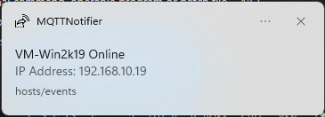

# MQTTNotifier
Lightweight Windows 10 background application that creates Toast Notifications from MQTT messages.

Designed intentionally for simplicity & portability:
- .NET Framework 4.5.2: probably even runs on Windows 8 (not tested)
- No additional runtimes, libraries or dependencies
- Portable: no installation required



## Message formats
Supports two message formats:
- Raw: Message text appears as the content
- JSON (HomeAssistant format): `{"title": "Message title", "message": "Hello world!"}`

# Usage
The program folder can be placed anywhere (e.g. C:\Program Files\MQTTNotifier)

Add a shortcut to `MQTTNotifier.exe` in your Startup folder (optional)

# Configuration
All configuration is in `MQTTNotifier.exe.config` - which must be located beside the executable itself.

# Building
The build toolchain that comes with Windows works:
```bat
PATH=%PATH%;C:\Windows\Microsoft.NET\Framework\v4.0.30319
msbuild
```

# Credits
Uses the M2MQTT library: https://www.nuget.org/packages/M2Mqtt/
